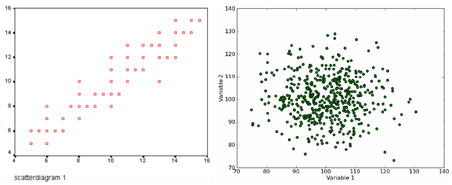
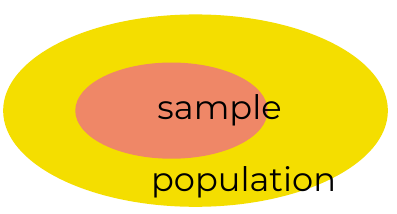
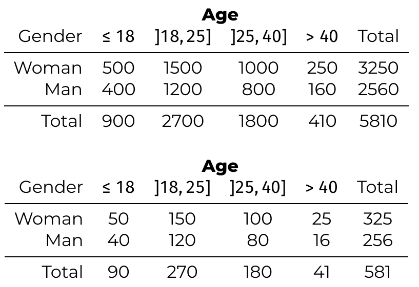

# Basic concepts in Data Science
## Variables & Values
**variable** = property of an object
**value** = specific state of variable
## Measurement Levels
= Variable types

Determine most suitable method for analysis
- visualization methods
- central tendency & dispersion
- examine relationship between variables
### Qualitative vs quantative
<table>
<tr><th>Qualitative</th><th>Quantitative</th></tr>
<tr><td>Not necessarily numeric Limited number of values</td><td>Number + unit of measurement Many values, often unique often contain result of measurement</td></tr>
</table>

#### Qualitative scales
- **Nominal** - Categories
  (gender, race, country, shape, ...)
- **Ordinal** - Order, rank
  (military rank, level of education, ...)
#### Quantitative Scales
- **Interval** - No fixed zero point $\implies$ no proportions
  ($°C$, $°F$)
- **Ratio** - Absolute zero point $\implies$ proportions
  (distance ($m$), energy ($J$), weight ($kg$))
  
Proportions:
- $20m$ is $1/3$th longer than $15m$
- $20°C$ **isn't** $1/3$th warmer than $15°C$ (convert to $°F$)
## Relations between variables
Variables are related if values change **systematically**

### Causal Relationships
- **Cause** - Independent variable
- **Consequence** - Dependent variable
#### Fake correlations / "Spurious correlations"
A relationship between variables does **not** necessarily indicate a causal relation!
# Sample testing
## Sample & population
- **Population** - collection of all objects/people/... that you want to investigate
- **Sample** - *subset* of population from which measurements will be taken

Under certain circumstances, the results for a sample are representative for the population.
## Sampling method
$$
\text{Definition of population}\\
\downarrow\\
\text{Define sampling frame}\\
\downarrow\\
\text{Choice of sampling method (budget \& time)}
$$
## How select elements for sample
- **Random sample** 
  - every element from population has equal chance of being included in sample
- **Non-random sample**
  - elements for sample are *not* randomly selected
  - objects that can be collected easily are more likey to be included (convenience sampling)
## Stratified to variables

## Possible Errors
Measurements in a sample will typically deviate from the value in the entire population $\implies$ Errors!
### Sampling errors
- Accidental sampling errors
	- pure **coincidence**
- Systematic sampling errors
	- Online survey: people without internet are excluded
	- Street survey: only people who are walking there are included
	- Voluntary survey: only interested parties participate
### Non-sampling errors
- Accidental non-sampling errors
	- Incorrectly ticked answers
- Systematic non-sampling errors
	- Poor or non-calibrated measuring **equipment**
	- Value can be **influenced** by the fact that you measure
	- Respondents **lie** (number of cigarettes a day)