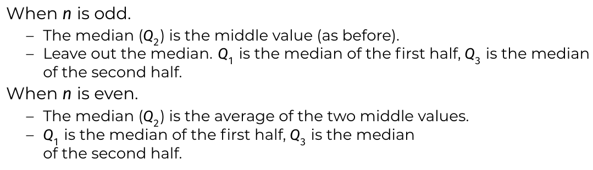
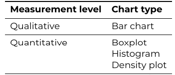
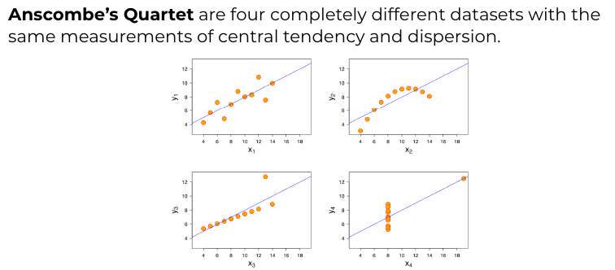

# Central Tendency and Dispersion
## Measure of Central Tendency
What value is representative of entire group?
### Mean vs average
- **Arithmic mean** $\overline x$ = sum of all values divided by number of values
$$
\overline x = \frac{1}{n}\sum_{i=1}^{n} x_i
$$
- **Median** = middle number of all values sorted
- **Mode** = value that appears most often in dataset
## Measures of Dispersion
How large are differences within group?
- **Range** = absolute value of difference between highest & lowest value
$$
\text{abs}(x_{\text{min}} - x_{\text{max}})
$$
- **Quartiles** of sorted set of numbers = $3$ values $Q_1, Q_2$ and $Q_3$ that divide set into $4$ equally large subsets
	- Calculation:
	  
- **Interquartile Range (IQR)** = difference between third & first quartile
  $$
  \left\vert Q_3 - Q_1 \right\vert
  $$
- **Variance** ($s^2$  or $\sigma^2$) = mean squared diffference between values of a data set and arithmic mean
$$
s^2 = \frac{1}{n-1}\sum_{i=1}^n\left(x_i - \overline x\right)^2
$$
- **Standard deviation** ($s$ or $\sigma$) is square root of variance
### Properties of standard deviation $\sigma$
|Property|Reason|
|-|-|
|$\sigma \ge 0$|$\sigma = \sqrt{\sigma^2}$ and number under $\sqrt{\text{ }}$ is never $<0$|
|Smallest possible value is $0$|If all values are equal to eachother. It means that there is no spread.|
|Outliers affect $\sigma$ more|their difference with the mean is squared|
|The unit of standard deviation $\sigma$ is the same as the unit of the original variable $x$|because $x$ is squared and then the root is taken|

When you're working with a sample (not the whole population), you use $n-1$ in the denominator to get an unbiased estimate of the population variance. This is called *Bessel’s correction*.

The variance formula involves squaring the differences from the mean. When you use the sample mean, you're essentially using a statistic that's already tailored to the data. That costs you $1$ degree of freedom; you've used one piece of information (the mean) to calculate the rest.

That’s why we divide by $n-1$:
- $n$ data points
- $1$ constraint (the mean is fixed once you pick the rest)
- $\implies n-1$ degrees of freedom
## Summary
### Central tendency & dispersion
|Measurement level|Center|Spred Distribution|
|-|-|-|
|Qualitative|Mode|/|
|Quantitative|Average/Mean|Variance, Standard Deviation|
||Median|Range, IQR|
### Symbols
||Population|Sample|
|-|-|-|
|# of elements|$N$|$n$|
|average / mean|$\mu$|$\overline x$|
|variance|$\sigma^2 = \frac{1}{N}\sum\left(x_i-\mu\right)^2$|$s^2 = \frac{1}{n-1}\sum\left(x_i - \overline x\right)^2$|
|standard deviation|$\sigma$|$s$|
# Data visualisation
## Simple Graphs
### Chart type overview

### Pie chart
Disadvantages:
- Comparing angles << comparing length
- unusable fir data with many categories
## Interpretation of Charts
Tips:
- Label the axes
- Clear title
- Name the unit (and, if necessary, order of magnitude)
- Add a label that clarifies the chart
- Avoid bells & whistles
- Minimize "ink to data" ratio

### Data distortion
= misrepresenting data so that invalid conclusions are drawn

### Importance of visualization
