# Probability
**Probability** = relative frequency of occurence of event at hand
- Probabilities = numbers assigned to sets
- these sets $\in$ universe $\Omega$

### Axioms of Probability
|Rule|Formula|
|-|-|
|Probabilities are non-negative|$\forall A \in \Omega: \mathcal P(A) \ge 0$|
|Universe has probability 1|$\mathcal P(\Omega) = 1$|
|Sum rule for disjoint events|$A \cap B = \varnothing \implies \mathcal P(A \cup B) = \mathcal P(A) + \mathcal P(B)$|
### Properties of probabilities
|Name|Formula|
|-|-|
|Complement rule|$\mathcal P(\overline A) = 1 - \mathcal P(A)$|
|Impossible event|$\mathcal P(\varnothing) = 0$|
|General sum rule|$\mathcal P(A \cup B) = \mathcal P(A)+\mathcal P(B) - \mathcal P(A \cap B)$|
### Independent events $A \perp\!\!\!\perp B$
$$
A \perp\!\!\!\perp B \iff \mathcal P(A\cap B) = \mathcal P(A) \cdot \mathcal P(B)
$$
$\implies$ for dependent events, $=$ changes to $\ne$
## Discrete random variables
Discrete = finite set of possible outcomes
### Probability mass function
The probability that variable $X$ is value $x$.
$$
f_X(x) = \mathcal P(X = x) = \frac{\text{Aantal nuttige uitkomsten}}{\text{Totaal aantal uitkomsten}}
$$
You can use it to compute other probabilities, e.g. $\mathcal P(X\le 2) = \mathcal P(X=0) + \mathcal P(X=1) + \mathcal P(X=2)$
## Expectation and variance of a random variable
### Expectation of a random variable
$$
\mu_X = \sum_i x_i \mathcal P(X=x_i) = \sum_i x_i f_X(x_i)
$$
Also written as $\mu$
### Variance of a random variable
$$
\sigma^2_X = \sum_i \left( x_i  - \mu_X\right)^2 \mathcal P(X=x_i) = \sum_i \left( x_i  - \mu_X\right)^2 f_X(x_i)
$$
Standard deviation = positive sqrt of variance:
$$\sigma_X = \sqrt{\sigma^2_X}$$
## Continuous Random Variables
- Continuous = infinite possibilities
- Probability that $a$ is *exactly* something is always $0$
  $\implies$ consider intervals
- probability can be found by *integrating* the probability density function
## The (Standard) Normal Distribution
### Normal distribution
$$x \in X \sim \text{Nor}(\mu, \sigma)$$
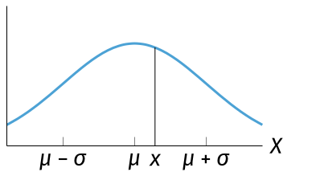
- Expectation
$$
\mu_X = \int_{-\infty}^{+\infty}x f_X(x)dx
$$
- Variance
$$
\sigma_X^2 = \int_{-\infty}^{+\infty} \left(x-\mu_X\right)^2 f_X(x)dx
$$
### Standard normal distribution
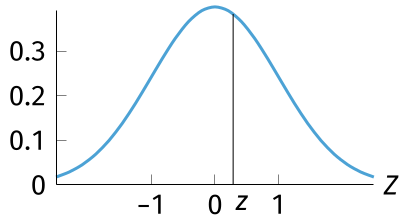
$$x \in X \sim \text{Nor}(0, 1)$$
- $x$ and $z$ have similar position in Gaussian bell curve
  $\implies$ $x = \mu + z \cdot \sigma$ and $z = \frac{x - \mu}{\sigma}$
  

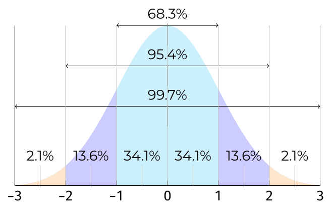
## Probabilities in the Normal Distribution
### Python functions
`import scipy.stats`
|Function|Purpose|
|-|-|
|`norm.pdf(c, loc=m, scale=s`|Probability density at `x`|
|`norm.cdf(x, loc=m, scale=s)`|Left-tail prbability $\mathcal P(X<x)$|
|`norm.sf(x, loc=m, scale=s)`|Right-tail probability $\mathcal P(X>x)$|
|`norm.isf(1-p, loc=m, sclale=s)`|$p\%$ of observations are expected to be lower than result|

e.g. $X \sim \text{Nor}(\mu = 5, \sigma = 1.5): \mathcal P(X>6) =$ `stats.norm.sf(6, loc=5, scale=1.5)`
## Other Continuous Distributions
### Exponential distribution
when more smaller values than larger values
e.g.
- money spent in grocery store per customer
- amount of time clerk spends with their customers
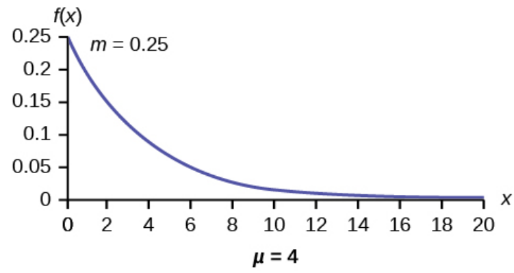
### Continuous uniform distribution
- has arbitrary outcome between two bounds
- density function = constant
  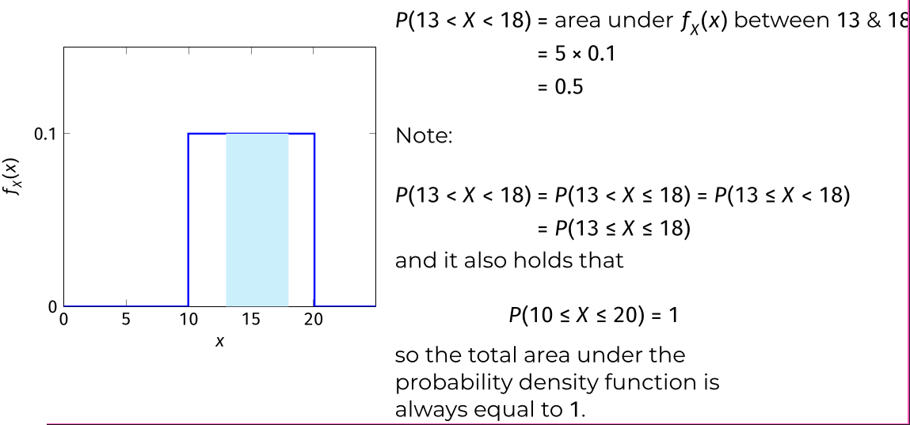
# From Sample to Population
## The Central Limit Theorem
If the size is sufficiently large, the **probability distribution** of the **sample mean** will approximate a normal distribution regardless of probability distribution of underlying population.

sample of $n$ observations from population with expected value $\mu$ and standard deviation $\sigma$. If $n$ sufficiently large:
$\overline x \sim \text{Nor}(\mu = \mu_{\overline x}, \sigma_{\overline x} = \frac{\sigma}{\sqrt n})$
## Point estimate
**point estimate** for population parameter = formula / equation to calculate value estimate for that parameter. (e.g. sample variance & standard deviation)
## Confidence Intervals
**Confidence interval** = equation / formula to construct interval that will contain parameter to be estimated with certain leverl of confidence.
## Confidence Interval for a Large Sample
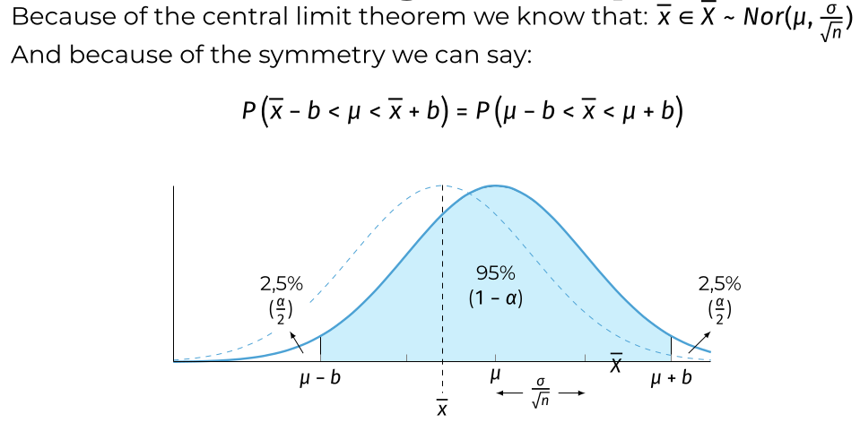
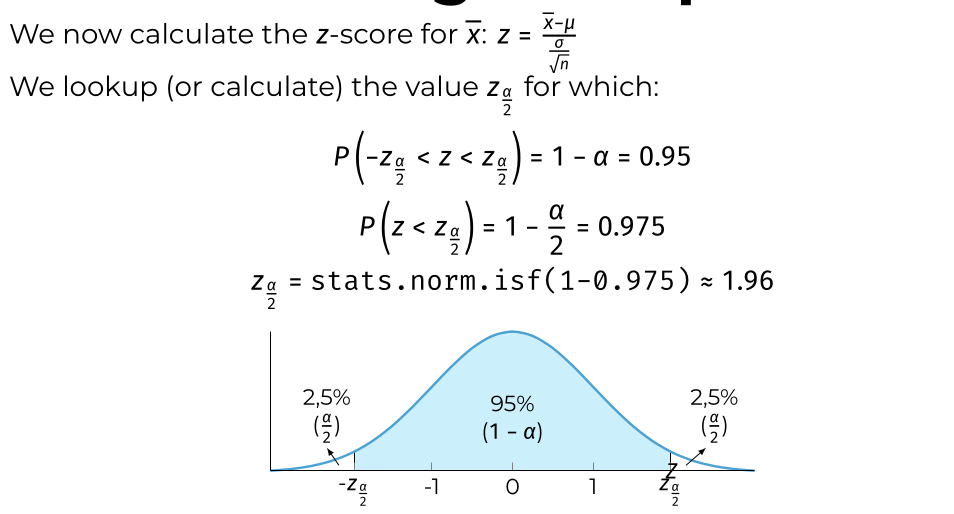
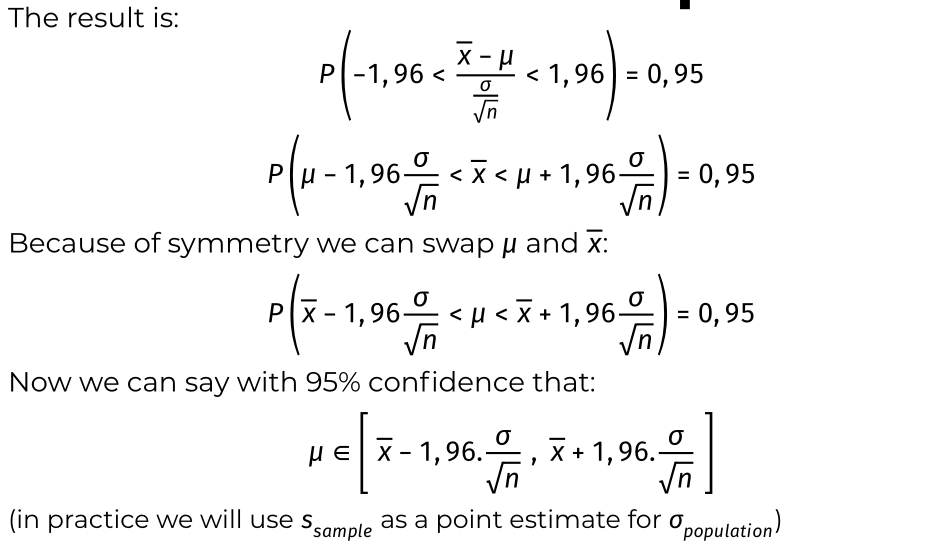
## Confidence Interval for a Small Sample
if $X \sim \text{Nor}(\mu, \sigma)$ and you take a small sample with mean $\overline x$ and stddev $s$, then
$$
t = \frac{\overline x - \mu}{\frac{s}{\sqrt n}}
$$
will behave as $t$-distribution with $n-1$ deg of freedom
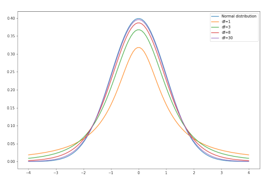
### $t$-distrbution in Python
df = degrees of freedom
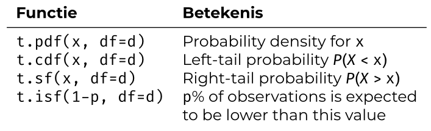
### Confidence interval
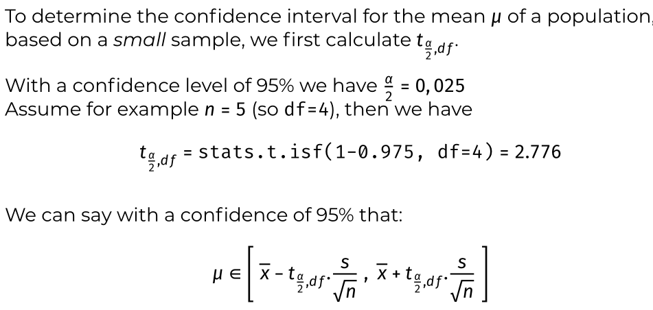