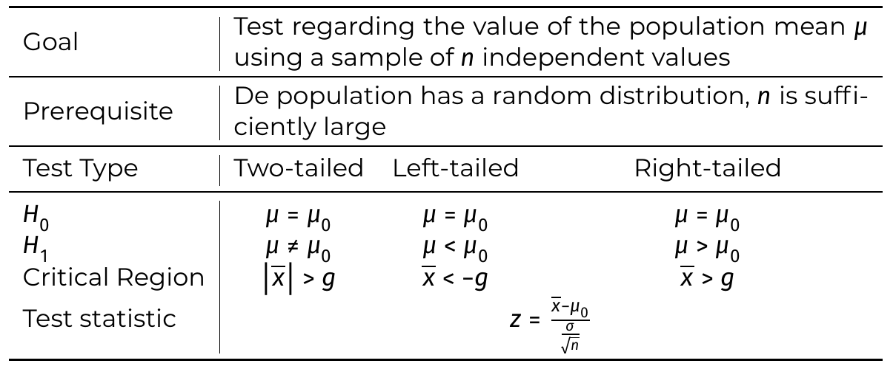
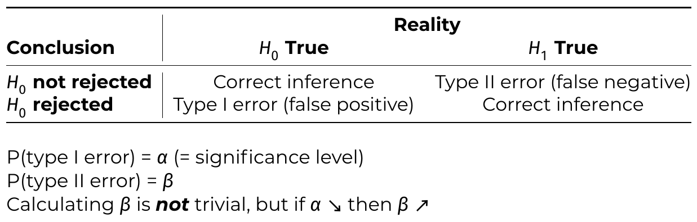

## Hypothesis
- **Hypothesis** - statement yet to be (dis)proven
- **Hypothesis Test** - test to (dis)prove hypothesis
- **Null Hypothesis ($H_0$)** - Base hypothesis, assumed to be true
- **Alternative Hypothesis ($H_1, H_a$)** - Conclusion of $H_0$ is rejected
## Elements of testing procedure
- **Test statistic** - value that is calculated from sample
- **Region of Acceptance** - region of values supporting $H_0$
- **Critical Region / Region of rejection** - region of values rejecting $H_0$
- **Significance level** - probability of falsely rejecting $H_0$

# Testing procedure
1. Formulate $𝐻_0$ and $H_1$
2. Determine significance level ($\alpha$)
3. Calculate test statistic
4. Determine critical region / probability value
5. Draw conclusions
# Probability Value
**$p$-value** = probability under $H_0$ to obtain value for the test statistic that is at least as extreme as observed value

- $p< \alpha \implies$ reject $H_0$
- $p> \alpha \implies$ accept $H_0$
# Critical Region
**Critical region** = collection of all values of test statistic for which we can reject $H_0$

## Right-tailed testing
look for value $g$ for which $\mathcal P(M>g) = \alpha$

determine $z_\alpha$ for which $\mathcal P(Z>z_\alpha) = \alpha$, so:
$$
g = \mu + z_\alpha \cdot \frac{\sigma}{\sqrt n}
$$
left of $g$: accept, right of $g$: reject
#### In python
$\alpha = 0.05 \implies z_\alpha = 1.645$
($z_\alpha =$`stats.norm.isf(1-0.95)` )
## Left-tailed testing
$$
g = \mu - z_\alpha \cdot \frac{\sigma}{\sqrt n}
$$
## Two-tailed testing
$$
g = \mu \pm z_\alpha \cdot \frac{\sigma}{\sqrt n}
$$
## Summary of testing procedures

## Requirements for $z$-test
- Sample is random
- Sample size $\ge 30$
- test statistic $\sim \text{Nor}$
- standard deviation of population, $\sigma$, is known
# Student’s $t$-test
## Requirements
- sample is random (?)
- variable is normally distributed
## Test
Critical value $g$ is:
$$
g = \mu \pm t \cdot \frac{s}{\sqrt n}
$$
- $t$ = derived from student's $t$-distr. based on number of degrees of freedom, $n-1$
  - t = `t.isf()` in python

apart from $t$, procedure is identical to $z$-test
# Errors in Hypothesis Tests
