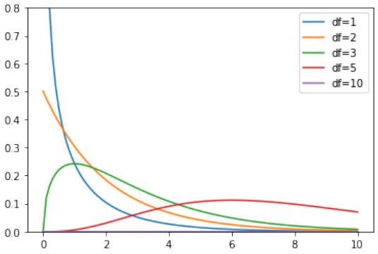

### Overview
|Independent|Dependent|Test/Metric|
|-|-|-|
|Qualitative|Qualitative|$\chi^2$-test<br>Cramér's $V$|
|Qualitative|Quantitative|two sample $t$-test<br>Cohen's $d$
|Quantitative|Quantitative|$\_$<br>Regression, correlation|
# Bivariate analysis
- $=$ determining if there is an association between stochastic variables $X$ and $Y$
- **Association** = you can predict (to some extent) value of $Y$ from value of $X$
	- $X$ = indepentent var
	- $Y$ = dependent var
- $\textcolor{red}{\text{association}\ne\text{causation}}$
# Contingency tables
## The chi-squared statistic
$$
\chi^2 = \sum_i \frac{\left(o_i - e_i\right)^2}{e_i}
$$
met
- $o_i$ = number of observations in $i$th cell of contingency table
- $e_i$ = exptected frequency

The larger the value $\rightarrow$ the stronger the association
## Cramér’s V
$$
V = \sqrt{\frac{\chi^2}{n(k-1)}}
$$
met
- $n$ = number of observations
- $k = \text{min}(\text{numRows}, \text{numCols})$

| Cramér's V|Interpretation|
|-|-|
|$\approx 0$|no association|
|$\approx 0.1$|weak association|
|$\approx 0.25$|moderate association|
|$\approx 0.5$|strong association|
|$\approx 0.75$|very strong association|
|$\approx 1$|complete association|
# Chi-squared test for independence
- = Alternative to Cramér’s V to investigate association between qualitative variables.
- Value of $\chi^2$ distributed according to the $\chi^2$ distribution

## $\chi^2$-distribution in python
`import scipy.stats`
|Function|Purpose|
|-|-|
|`chi2.pdf(x, df=d)`|probability density for $x$|
|`chi2.cdf(x, df=d)`|left-tail probability $\mathcal P(X < x)$|
|`chi2.sf(x, df=d)`|right-tail probability $\mathcal P(X > x)$|
|`chi2.isf(1-p, df=d)`|$p\%$ of observations is expected to be lower than resulting value|
## Test procedure
1. Formulate hypotheses:
  - $𝐻_0$ : there is no association ($\chi^2$ is “small”)
  - $𝐻_1$ : there is an association ($\chi^2$ is “large”)
2. Choose significance level $\alpha$
3. Calculate the test statistic $\chi^2$
4. Use  𝑑𝑓 = (𝑛𝑢𝑚𝑅𝑜𝑤 − 1) × (𝑛𝑢𝑚𝐶𝑜𝑙 − 1) and either:
  - Determine critical value $𝑔$ so $\mathcal P(\chi^2 > 𝑔) = \alpha$
  - Calculate the $𝑝$-value
5. Draw conclusion:
  - $\chi^2$ < 𝑔: do not reject $𝐻_0$ ; $\chi^2$ > 𝑔: reject $𝐻_0$
  - 𝑝 > 𝛼: do not reject $𝐻_0$ ; 𝑝 < 𝛼: reject $𝐻_0$
## Test for independence in python
```python
observed = pd.crosstab(rlanders.Survey, rlanders.Gender)
chi2, p, df, expected = stats.chi2_contingency(observed)

print(”Chi-squared: %.4f” % chi2)
print(”Degrees of freedom: %d” % df)
print(”P-value: %.4f” % p)
```
# Goodness-of-fit test
$\chi^2$ can also be used to determine if sample is representative for population

**goodness-of-fit test** indicates to what degree a sample corresponds to $H_0$ regarding the distribution of a qualitative variable over mutually exclusive classes.

higher => more representative

$$
\chi^2 = \sum_{i=1}^n \frac{(o_i - e_i)^2}{e_i}
$$
Draw a conclusion based on the value of 𝜒 2 :
- small $\implies$ distribution is representative
- large $\implies$ distribution is not representative

$\chi^2$ measures the degree of conflict with the null hypothesis

- test statistic $\chi^2$ follows the $\chi^2$ distribution
- critical value $g$ is dependent on degrees of freedom
  $$\text{df} = k-1$$
  with $k$ = number of categories
- critical value $g$ for given significance level $\alpha$ & given $\text{df}$ can be calculated in python using `isf()`
  $$\mathcal P(\chi^2 < g) = 1 - \alpha$$
## Testing procedure for goodness of fit test
1. Formulate hypotheses
  - $H_0$: sample is representative for the population
  - $H_1$ : sample is not representative for the population
2. Choose significance level: $\alpha = 0.05$
3. Calculate test statistic:
$$\chi^1 = \sum_{i=1}^n\frac{(o_i - e_i)^2}{e_i}$$
$\text{    }\text{    }\text{    }$A. **Critical area**: Calculate $g$ so that $\mathcal P(\chi^2 < g) = 1 - \alpha$
$\text{    }\text{  }\text{    }$B. **Probability value**: Calculate $p = 1 - \mathcal P(X < \chi^2)$
4. Conclusion (the test is always right-tailed):
$\text{    }\text{    }\text{    }$A. $\chi^2 < g \implies$ do not reject $H_0$, $\chi^2 > g \implies$ reject $H_0$
$\text{    }\text{    }\text{    }$B. $p > \alpha \implies$ do not reject $H_0$, $p < \alpha \implies$ reject $H_0$
## Goodness-of-fit in Python
```python
observed = np.array([127, 75, 98, 27, 73])
expected_p = np.array([.35, .17, .23, .08, .17])
expected = expected_p * sum(observed)
chi2, p = stats.chisquare(f_obs=observed, f_exp=expected)

print(”χ² = %.4f” % chi2)
print(”p = %.4f” % p)
```
# Standardized residuals
# Cochran’s rules