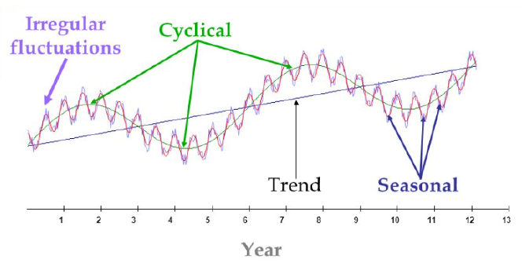
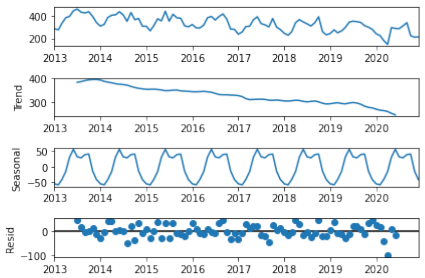
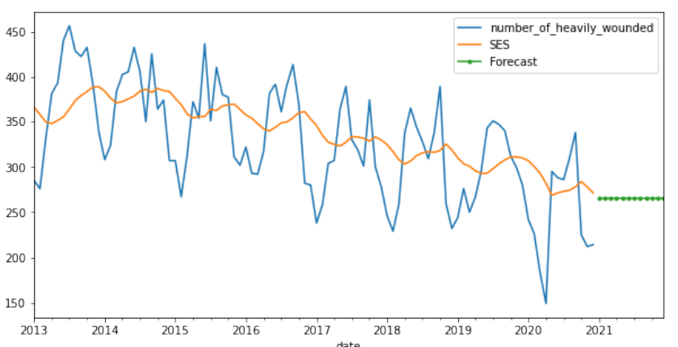

# Time series and predictions
**Time series** - sequence of observations of some variable over time
### Components
- Level
- Trend
- Seasonal fluctuations
- Cyclic patterns
- Random Noise (residuals)

### Decomposition

# Time series models
## Mathematical model
### Simplest model (constant relationship?)
$$X_t = b + \varepsilon_t$$
- $X_t$ - estimate for time series $t$
- $b$ - **level** (constant), based on observations $x_t$
- $\varepsilon_t$ - random **noise**
  We assume $\varepsilon_t \sim ŧext{Nor}(\mu = 0; \sigma)$
  
### Linear relationship
$$X_t = b_0 + b_1t + \varepsilon_t$$
with **level** $b_0$ & **trend** $b_1$
### Polynomal case
$$X_t = b_0  + b_1t + b_2t^ 2 + \dots + b_nt^ n + \varepsilon_t$$
## General expression time series
$$X_t = f(b_0, b_1, b_2, \dots, b_n, t) + \varepsilon_t$$
Assumptions:
- We consider 2 components of variability:
	- mean of predicitons changes with time
	- variations to this mean vary randomly
- residuals of the model $(X_t - x_t)$ have constant variance in time (**homoscedastic**)
## Estimating the parameters
Make predictions based on time series model:
1) select most suitable model
2) estimation for params $b_i$ based on observations

Estimations $\hat b_i$ are selected so that they approximate observed values as close as possible
# Moving average
## Simple moving average
**Moving average** = series of averages of last $m$ observations.
- Notation: SMA
- Hide short-term fluctuations and show long)term trends
- Parameter $m$ = window
- weights of observations are equal
$$\text{SMA}(t) = \sum_{i=k}^ {t}\frac{x_i}{m}$$
With $k = t - m + 1$
## Weighted moving average
- most recent observations gain relatively more weight
- specific form of this: single exponential smoothing / **exponential moving average** (**EMA**)
### Exponential smoothing
**Implicit** function:
$$X_t = \alpha x_{t-1} + (1 - \alpha) X_{t-1}$$
with
- $\alpha$ = smoothing constant $(0 < \alpha < 1)$
- $t \ge 3$
- only valid from $t=3$
	- so need to choose suitable value for $X_2$ ourselves:
		- $X_2 = X_1$
		- $X_2 = \frac{1}{m} \sum_{i=1}^ mx_i$ (mean of first $m$ obs)
		- $X_2 =$ specific objective
		- $\dots$

**Explicit** function:
$$X_t = \alpha x_{t-1} + (1-\alpha)X_{t-1}\\
= \alpha x_{t-1} + (1-\alpha)\bigg(\alpha x_{t-2} + (1-\alpha)X_{t-2}\bigg)\\
= \alpha x_{t-1} + \alpha(1-\alpha)x_{t-2} + (1-\alpha)^ 2X_{t-2}\\
\vdots\\
= \alpha \sum_{i=1}^{t-2}(1-\alpha)^ {i-1}x_{t-i} + (1-\alpha)^{t-i}X_{t-i}\qquad (t\ge 2)
$$
$\implies$ older observations have exponentially smaller weight

Speed at which older observations are "**forgotten**" depends on value of $\alpha$
- $\alpha$ close to $1$ $\implies$ old observations are quickly forgotten
- $\alpha$c close to $0$ $\implies$ less fast
#### Forecasting
As firecast for time $t+m$ ($m$ = units in time in the future), we always take last estimate of level:
$$F(t+m) = X_t$$

## Double exponential smoothing
- for when data has a trend
- add additional term to model: $b_t$ for estimation of trend at time $t>1$:
$$X_t = \alpha x_t +(1-\alpha)(X_{t-1} + b_{t-1})$$
$$b_t = \beta(X_t - X_{t-1})+(1-\beta)b_{t-1}$$
- with $0<\alpha 1$ & $0 < \beta < 1$
- $b_t$ = estimate for slope of **trend** line
- $X_t - X_{t-1}$ = positive or negative; corresponds to increasing / decreasing trend

Different options for selecting initial values
- $X_1 = x_1$
- $b_1 = x_2 - x_1$
- $b_1 = \frac{1}{3}\big[(x_2 - x_1) + (x_1 - x_2) + (x_4 - x_3)\big]$
- $b_1 = \frac{x_n - x_1}{n-1}$
## Forecasting
To make prediciotn / forecast $F(t+1)$ for time $t+1$ we use
$$F(t+1) = X_t + b_t$$
or in general for time $t+m$
$$F(t+m) = X_t + mb_t$$
## Triple exponential smoothing
aka **Holt-Winter's Method**
For recurring patterns
- $L$ = length of seasonal cycle (number of time units)
- $c_t$ = models seasonal variations
- $\gamma$ = smoothing factor for seasonal variation

$$X_t = \alpha \frac{X_t}{c_{t-L}} + (1-\alpha)(X_{t-1} + b_{t-1})\qquad\qquad\text{Smoothing}\\
b_t = \beta(X_t - X_{t-1}) + (1-\beta)b_{t-1}\qquad\text{  Trend smoothing}\\
c_t = \gamma\frac{x_t}{X_t} + (1-\gamma)c_{t-L}\qquad\qquad\text{   Seasonal smoothing}
$$

Prediction at time $t+m$
$$F_{t+m} = (X_t + mb_t)c_{t-L+m}$$

## Quality of a time series model
Compare forecast results with actual observations when available:
- MAE = $\frac{1}{m} \sum_{i=t+1}^ {t+m}\big|x_i - F_i\big|$
- MSE = $\frac{1}{m} \sum_{i=t+1}^ {t+m} (x_i - F_i)^ 2$

If $\sqrt{\text{MSE}}$ is well below standard deviation over all observation $\implies$ good model.